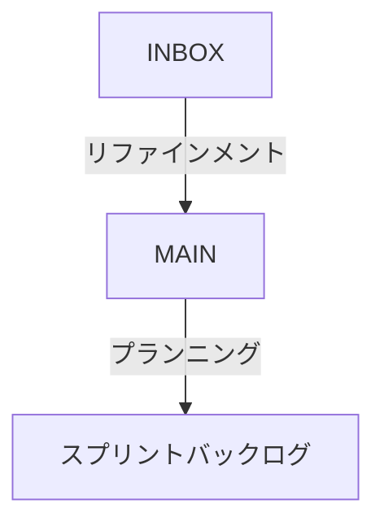

こんにちは！Nstock でエンジニアをしています、jagaです 🥔

Nstock ではオーナーシップの醸成・プロセス改善・属人化の解消といった目的で、スクラムイベントのファシリテーターを週次で交代していています。誰でもスクラムを回せるようにする上で、DBを自在にカスタマイズできる Notion は非常に重宝しています。

一方で、プロダクトバックログの管理に特化したツールに比べると、どうしても操作感で見劣りしてしまう部分はあります。そんな中でも、レトロスペクティブでの振り返りを活かし、いくつかの工夫をすることによって、以前よりも使いやすいプロダクトバックログになってきました。

本記事ではプロダクトバックログアイテム(以下 PBI と表記)のフェーズ遷移にフォーカスして、Nstockの取り組みを紹介していきます。

Nstock のスクラムについては以前執筆した記事も併せてご覧ください。

[開発組織の立ち上げと、はじめてのスクラムと](https://zenn.dev/nstock/articles/start-scrum-at-nstock)

:::message
本記事は 2023/12/18 に、別サイトで公開した記事を Zenn に移管した記事となります
:::

# 本記事で伝えたいこと

- PBIのフェーズ遷移はユースケースに合わせた[DBビュー](https://www.notion.so/ja-jp/help/views-filters-and-sorts)を使うとラクだよ(本記事のDBはNotionのDBを指します)
- DBプロパティを更新する定型作業はボタンに任せるとラクだよ

# PBI の3つのフェーズ

前提として、Nstockのプロダクトバックログでは3つのフェーズがあります。新規に作成された PBI はまず INBOX に入り、その後直近で手をつけるものが MAIN へ、今回のスプリントで手をつけるものがスプリントバックログへと移動していきます。

フェーズ管理には `Relation` 型の `Sprint` プロパティを利用しています。

*PBIの主要なプロパティ*

それでは、3つのフェーズについて見ていきましょう。

## INBOX

新しく起票した PBI はまず初めに INBOX に入ります。

*INBOX*

このビューには、まだリファインメントも着手もされていない PBI が並んでいます。

DBのビューとしては、

- `Sprint`プロパティが空
- `Status`プロパティが`Complete`でない

の両方を満たす PBI を、新しい順に表示することで実現しています。

## MAIN

INBOX の PBI のうち、直近取り組むものはリファインメントで MAIN に移されます。 MAIN では、直近で取り組む PBI が、優先度順に並んでいます。リファインメントでは MAIN の PBI を上から順に、受け入れ条件の定義とストーリーポイントの見積もりを行います。

*MAIN*

DB のビューとしては

- `Sprint`プロパティが`MAIN` (`MAIN` は `Sprint DB`のページの一つでもあります)
- `Status`プロパティが`Complete`でない

の両方を満たす PBI が、マニュアルの並び順で表示されます。ソート順を指定していないのは、自分たちで優先度順に並び替えるためです。以前は `Select` 型の `Priority` 属性を用意して、自動ソートできないか試していました( `P1` , `P2` , `P3` みたいなイメージ )が、優先順位を表現しきれず、ワークしませんでした。

ちなみに、ある PBI は `MAIN` に表示されるようになった( `Sprint` プロパティが空でなくなった )時点で、 `INBOX`には表示されなくなります。

## スプリントバックログ

スプリント開始時のプランニングにて、そのスプリントで取り組む PBI をスプリントバックログに移動します。Nstock ではスプリントに通し番号を振っており、例えば `Sprint #66` は66回目のスプリントであることを意味します。

*スプリントバックログ*

DBのビューとしては

- `Sprint`プロパティが`Sprint#66` などのスプリント(`MAIN` は `Sprint DB`のページの一つでもあります)
- `Status`プロパティが`Complete`でない

の両方を満たす PBI が、マニュアルの並び順で表示されます。

# フェーズ移動をラクにする工夫

スクラムイベントの中で、INBOX から MAIN、そして MAIN からスプリントバックログへ PBI を移動する必要があります。そのような移動をラクにするための工夫を２つ紹介します。

## 工夫#1 MAIN とスプリントバックログは1つのビューに集約する

MAIN とスプリントバックログは、HOME と呼ばれる単一のDBビューでまとめて見ることができます。

*HOMEビュー*

以前はスプリントバックログと MAIN を別の DB ビューに表示していました。 `MAIN`→ `スプリントバックログ`に移動する際に、「 `Sprint` 属性から `MAIN`を消して、新しいスプリントを紐づけて…」という作業をスプリントバックログに入れる PBI 全てに対して行っていたため、付け替えが非常に面倒でした。

そこで、スプリントバックログ と MAIN を同じビューに表示するようにしました。これにより、ドラッグ&ドロップで直感的に INBOX からスプリントバックログへ移動することができるようになりました 🙌

プランニングの際には複数のPBIをまとめて移動したいので、その時には複数選択機能を使っています。一つ一つチェックボックスを入れるのは大変なので、どれか一つの PBI を選択した後に、 `Shift + ↓`で範囲選択すると楽です。

*PBIの選択範囲*

MAIN とスプリントバックログを並べるために、DBのグループ機能を利用しています。

*グループ機能*

`Sprint` プロパティでグループすると、上述のようなビューを作成することができます。終わったスプリントバックログを非表示にしたり、新しいスプリントバックログを表示したりする操作は、ファシリテーターがレビューの際に行います。

:::details 余談) INBOXもHOMEビューに入れたら便利じゃない？
INBOX→MAINの移動もあるので、INBOXもHOMEビューに入れたら便利じゃない？と思われた方、まさにその通りです。HOMEビューでINBOXがMAINの下あたりに置ければ、移動がスムーズになって理想的だと思います。

ですが、今のNstockの仕組みではHOMEビューは `Sprint` プロパティの値を用いて実現しています。 そのため、`Sprint` プロパティが空の PBI をまとめて表示している INBOX を HOME ビューに置くことができません。

`MAIN` のように、`INBOX` という値を `Sprint` プロパティに持たせてグルーピングすることもできますが、つけ忘れを防ぐのが難しいと感じます。加えて現状の運用でそれほど困っていないため、INBOX を HOME ビューに入れることは現状考えていません。
:::
    
    

## 工夫#2 ボタンの活用

INBOX → MAINの移動を簡単にするため、各種プロパティの付け替えをするNotion ボタンをPBIの上部に用意しています。

*PBI上部のボタン*

 `Sprint` プロパティをクリックして、追加ボタンをおして、検索に `MAIN` と入力して…と作業するのを何件も繰り返すと、チリも積もって骨が折れます。

INBOX → MAIN に移動するボタンを用意することで、「INBOX → MAIN への移動はここを押せば良い」、という共通理解ができ、プロパティの更新作業時に迷わなくて済む、というのも、交代でファシリテーターを回す上での利点です。

ブレークダウンすると、2つ工夫しています。

１つ目は[同期ブロック](https://www.notion.so/ja-jp/help/synced-blocks)です。レトロスペクティブでの振り返りをもとにボタンの追加や更新を行うことが多いのですが、そうすると古いテンプレートで作成した PBI では最新のボタンが使えません。ボタンを同期ブロックにすることで、古いテンプレートで作成された PBI であっても、最新のボタンが使えるようになります。

２つ目はトグルです。トグルブロックにすることで、普段は閉じておき、スクラムイベントで操作する時のみ広げることで、普段の作業を妨げないようにしました。

# さいごに

感想お便り、自分たちはこうしているよ！というコメント、非常に励みになります！ぜひ気軽にお願いします。これからも「スクラム×Notion」というテーマで発信していきますので、また見に来てください👋

ちなみに、Notion ではスクラムのスプリントをより便利に管理できる Sprints 機能がパブリックベータで公開されています。現状、既存のDBを Sprints にアップデートする機能はないため、Nstock ではまだ利用できていませんが、非常に楽しみです🔥

[Sprints – Notion Help Center](https://www.notion.so/help/sprints)

また、Nstockではエンジニアを常に募集しています！

[👨‍👩‍👧‍👦**カジュアル面談**](https://herp.careers/v1/nstock/THyyh62L_Zkc)から気軽にお話しましょう〜！